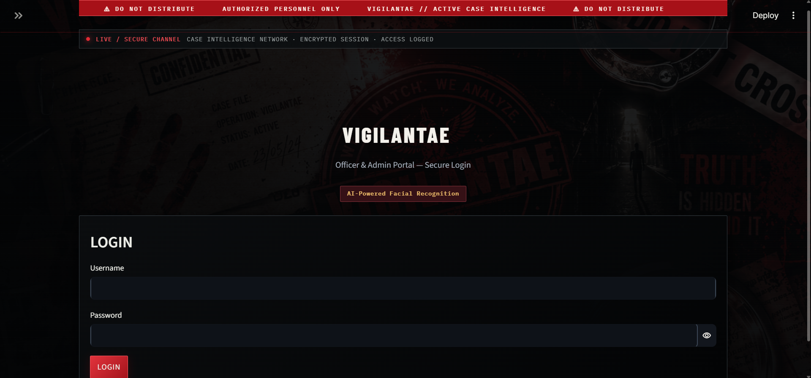
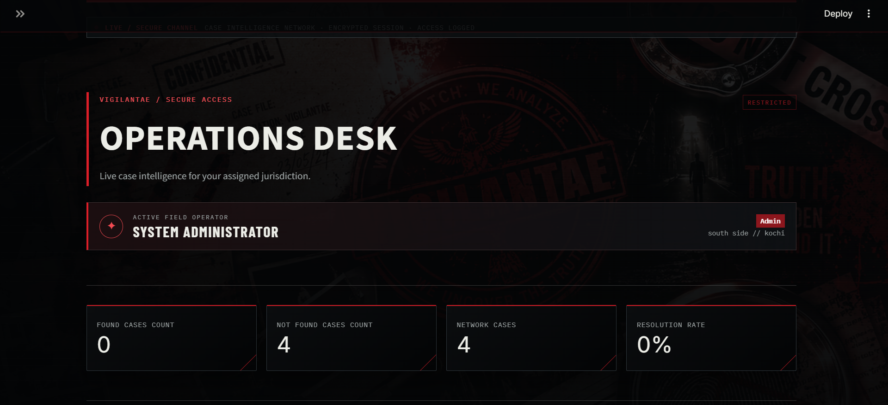
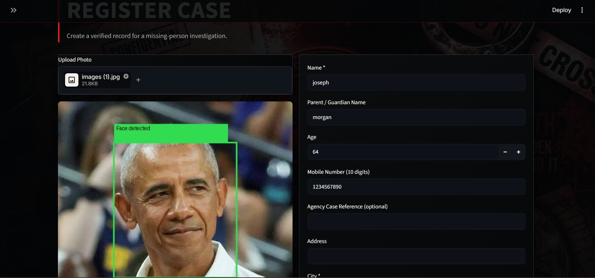
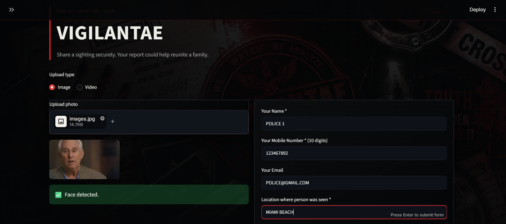
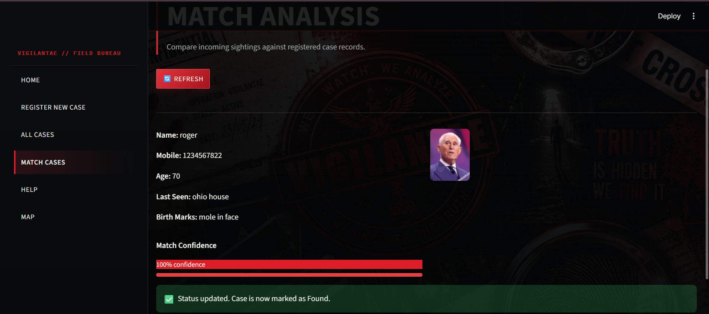
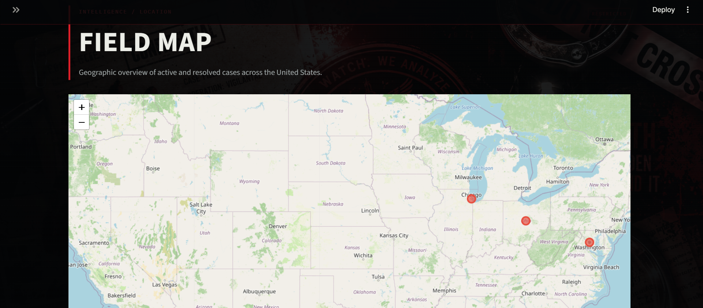

# Vigilantae

> A portfolio-grade case-intelligence prototype for missing-person reports and verified public sightings.

Vigilantae is a local-first Streamlit application that demonstrates a complete investigation workflow: staff register a case, a public portal accepts a sighting, face landmarks are compared, and reviewers can inspect records and city-level activity.


> **Safety note:** This is a portfolio prototype, not an identity-verification system. Biometric and personal data are sensitive. A potential match is an investigative lead and must be reviewed by an authorized human before any decision or action.

## Highlights

- Classified-console visual design with responsive Streamlit pages.
- Admin and Officer access roles.
- Case intake with multi-face selection and validation.
- Public sighting intake from images or videos.
- MediaPipe face-landmark extraction and KNN-based candidate matching.
- Case archive, editing controls, CSV export, U.S. city map, and optional SMTP match alerts.
- Local SQLite storage by default; optional PostgreSQL configuration for future deployment.
- Automated database and email-behavior tests, plus GitHub Actions verification.

## Screenshots

| Secure entry | Operations desk |
| --- | --- |
|  |  |

| Case registration | Public sighting intake |
| --- | --- |
|  |  |

| Match analysis | United States field map |
| --- | --- |
|  |  |

The repository also includes an [operations guide capture](assets/screenshots/operations-guide.png) and a personal project signature asset at [mrinel-signature.jpg](assets/screenshots/mrinel-signature.jpg).

## How it works

```text
Officer registers case + photo
            ↓
MediaPipe extracts face landmarks → local SQLite stores case + metadata
            ↓
Public portal receives a sighting photo/video
            ↓
Admin runs Match Cases → candidate matches are presented for human review
            ↓
Optional SMTP notification is sent after a match is recorded
```

## Quick start

### Prerequisites

- Python 3.12 recommended
- Git
- A clear test image that you are permitted to use

### 1. Clone and install

```powershell
git clone https://github.com/YOUR-USERNAME/vigilantae.git
cd vigilantae
python -m venv venv
.\venv\Scripts\Activate.ps1
pip install -r requirements.txt
```

### 2. Create your local administrator account

```powershell
Copy-Item login_config.example.yml login_config.yml
.\venv\Scripts\python.exe scripts\create_password_hash.py
```

Copy the generated hash into the `password:` field in `login_config.yml`. Also replace the display name, email, city, area, and cookie key. This local file is ignored by Git.

### 3. Run the private operations portal

```powershell
.\venv\Scripts\streamlit.exe run Home.py
```

On first face-detection use, the MediaPipe model downloads automatically. Local case records are saved in `sqlite_database.db`; local images are saved in `resources/`. Neither is committed to Git.

### 4. Run the public sighting portal (optional)

Use a second terminal:

```powershell
.\venv\Scripts\streamlit.exe run mobile_app.py --server.port 8502
```

## Local test flow

1. Sign in to `Home.py` as an Admin.
2. Register a dummy case using non-sensitive test data.
3. Confirm it appears in **All Cases** and **Map**.
4. Submit a permitted test sighting through `mobile_app.py`.
5. In the private portal, open **Match Cases** and run **Refresh**.
6. Review the result manually. Do not treat a score as verified identification.

## Optional email notifications

Email is disabled until SMTP settings are supplied. Use `.env.example` as a private configuration checklist, then set these environment variables in your terminal before starting Streamlit:

```text
SMTP_HOST=smtp.example.com
SMTP_PORT=587
SMTP_USER=operations@example.com
SMTP_PASSWORD=an-app-password
NOTIFY_EMAIL=operations@example.com
```

Use an app-specific password, not a normal email password. Without these values, matching continues to work and email is safely skipped.

## Verify the project

Run the same checks used in continuous integration:

```powershell
.\venv\Scripts\python.exe -m compileall -q Home.py mobile_app.py pages scripts tests
.\venv\Scripts\python.exe -m unittest discover -s tests -v
```

Or run both commands with:

```powershell
.\venv\Scripts\python.exe scripts\verify.py
```

## Repository hygiene

The following private/local files are intentionally excluded from version control:

- `login_config.yml` and `.streamlit/secrets.toml`
- `.env`
- `sqlite_database.db`
- `resources/` uploads
- `face_landmarker.task`
- `venv/`

Templates such as `login_config.example.yml`, `.env.example`, and `.streamlit/secrets.example.toml` are included so a new developer can configure the project safely.

## Project structure

```text
Home.py                 # Authenticated operations dashboard
mobile_app.py           # Public sighting portal
pages/                  # Case intake, archive, matching, map, and help screens
pages/helper/           # Database, matching, email, UI, and vision helpers
static/                 # Versioned visual assets
tests/                  # Automated regression tests
.github/workflows/      # GitHub Actions verification
```

## Responsible use

Vigilantae is a portfolio prototype. Do not use it with real personal or biometric information without appropriate authorization, consent, and safeguards.
